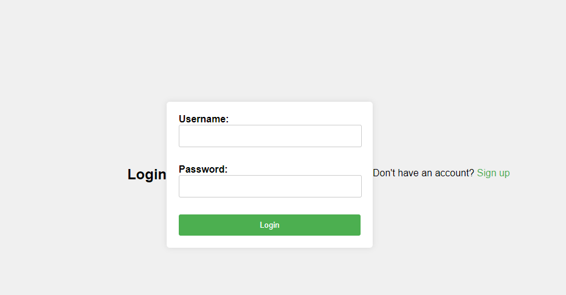

# Express User Authentication App



This is a simple Express.js application that implements user authentication using MongoDB and bcrypt. It includes routes for user signup, login, and a dashboard. The application also uses cookies for session management.

## Prerequisites

- Node.js
- MongoDB

## Installation

1. **Clone the repository:**

    ```bash
    git clone https://github.com/your-username/your-repo-name.git
    cd your-repo-name
    ```

2. **Install dependencies:**

    ```bash
    npm install
    ```

3. **Set up your MongoDB connection:**

    Create a `config.js` file in the root directory and add your MongoDB connection string:

    ```javascript
    module.exports = {
        dbUrl: 'mongodb://localhost:27017/your-database-name'
    };
    ```

## Usage

1. **Start the server:**

    ```bash
    npm start
    ```

2. **Access the application:**

    Open your browser and navigate to `http://localhost:3000`.

## Endpoints

- **GET /**: Renders the login page.
- **GET /signup**: Renders the signup page.
- **POST /signup**: Handles user signup. Expects `username` and `password` in the request body.
- **POST /login**: Handles user login. Expects `username` and `password` in the request body.
- **GET /dashboard**: Displays the user dashboard if logged in. Requires a valid `user_id` cookie.

## File Structure

- `public/`: Static files (e.g., CSS, JavaScript).
- `views/`: HTML views (`login.html`, `signup.html`).
- `models/`: Mongoose models (`user.js`).
- `config.js`: Configuration file for MongoDB connection.
- `app.js`: Main application file with Express routes and middleware.

## Dependencies

- `express`: Web framework for Node.js.
- `body-parser`: Middleware for parsing request bodies.
- `cookie-parser`: Middleware for parsing cookies.
- `mongoose`: MongoDB object modeling tool.
- `bcryptjs`: Library for hashing passwords.

## Contributing

Feel free to submit issues or pull requests. Please follow the coding guidelines and test your changes thoroughly.


---

Feel free to modify this README file as needed for your project.
